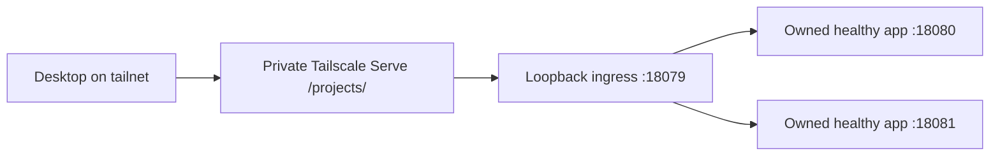

# TDD-018: Minimal private application workflow

- **Status:** Delivered — accepted initial single-web workflow
- **Owner:** Daniel
- **Specification:** [SPEC-018](spec.md)
- **Tasks:** [TASKS-018](tasks.md)

## Implemented approach

A user-scoped Python CLI orchestrates reviewed rootless Podman/user Quadlet
interfaces. Reuse the strict manifest validator and its isolated environment.
Keep runtime state under a platform-owned namespace on the project volume,
separate from authored manifests/source; keep disposable engine storage on the
root disk. The CLI is the documented lifecycle provider for the existing runtime
operation skill once its version, capabilities and receipt mapping are reviewed.
A bounded unprivileged ingress user service forwards only registered healthy
apps. No privileged broker or general control-plane daemon is introduced.

| Component | Responsibility |
|---|---|
| CLI and bounded state/operation receipt | Resolve project, validate, serialize transitions, allocate port, report health/status/logs |
| Single Next.js/TypeScript template | Pinned container toolchain, pnpm lockfile, tests, health route, base-path support and adapted guidance |
| Per-project rootless containers/Quadlet | Dependency/build/test execution and development service with limits and loopback publication |
| Private routing adapter | Register healthy owned apps behind the one-time shared Serve prefix, preserving existing configuration |

Implementation pins Node/pnpm/Next.js versions and an image digest, listed below.
These choices were checked against primary package/image sources. Project commands run with project root as
container working directory, matching manifest argument-vector semantics.
Dependencies/caches are project-specific; no credential/environment material is
mounted by default. Define writable cache paths needed by Next.js separately
from source and respect forge ownership. A read-only runtime root is preferred
where compatible; verify required temporary paths rather than relaxing privileges.

## Stage 1: Hello World on the desktop

After implementation authorization, resolve the current node DNS name, healthy
rootless/tool receipts, a free high loopback port, existing Serve configuration,
operator capability and Daniel's desktop tailnet access. Check HTTPS/certificate
readiness before expecting a private HTTPS URL. A read-only status response is
not proof of write authority. If prerequisites need operator or tailnet changes,
prepare their exact scope; host configuration follows the protected pipeline.
Tailscale's general Unix operator option is broader than a Serve-only grant and
must not be enabled casually as a workaround for a denied route operation.

Pin supported container/tool/framework versions, then implement a small
Next.js/TypeScript Hello World starter on the project volume. Include its v1
manifest, health route and `/projects/hello-world/` base-path configuration. Build
and run it as forge in a bounded rootless service with loopback host publication.
Initial reviewed commands or a narrow runner are sufficient; the final CLI can
follow. Do not pass the whole platform checkout as the app build context or mount
credentials. Inspect readiness directly on loopback before publishing.

Configure only the selected owned Serve path to that backend through the
approved operator interface. Verify actual forwarding of root, asset and health
paths on the installed version; a Serve mount path alone is not proof that the
backend receives its required prefix. Use a URL target with an explicit backend
path where supported and verify semantics, rather than assuming prefix handling.
Keep the rest of Serve configuration intact and verify no active Funnel route.

Return `https://<current-node-DNS>/projects/hello-world/` using the real current
node DNS from Tailscale, not a permanent hardcoded hostname. Daniel opens it on
his desktop and confirms the content. Record local health and desktop reachability
separately. Keep the owned service available for the confirmation, then demonstrate
scoped stop/route removal while retaining app source. In stage 2 reuse the starter
and safely reconcile the prototype resources; do not overwrite or adopt unknown
projects/services. A Serve inline-text response is not an application proof.

## Lifecycle and routing

`new` refuses an occupied destination and writes the selected template/manifest.
`validate` is read-only. `start` validates, obtains the per-project lock, reserves
an available port, prepares the reviewed container/service and waits within a
fixed deadline for the declared health path. Running is not ready. Record an
operation ID and final state; on timeout/lost response reconcile that operation
instead of blindly repeating it. `stop` removes owned running resources and the
owned route while preserving project source. Repeated operations are no-ops
where already satisfied; report busy for concurrent conflicting operations.

Keep the v1 author manifest unchanged: assigned ports, image IDs, operation IDs
and route ownership belong to runtime state. Check actual port availability in
addition to the allocation registry. Document bounds and nonzero error categories
before connecting the runtime-operation skill. Limit logs by lines/time and avoid
credentials/raw environment dumps; project output is untrusted data.

The application serves its declared `/projects/<slug>/` prefix. The installed
Serve CLI requires operator access, as demonstrated by forge's denied write.
Implementation therefore uses one operator-configured private `/projects/` route
to a loopback user service at port 18079. The CLI owns per-app mappings in its
validated registry; it never writes daemon preferences or grants itself operator
rights. This implements NET-101's private loopback ingress and the initial
NET-102/103 slices while avoiding a per-app privileged operation.

The router preserves the requested prefix/query, forwards bounded HTTP responses
and development WebSocket upgrades, and rejects unknown/stopped targets. Actual
Next.js 16.4 uses `/_next/hmr` beneath its base path; live handshake verification
passed through ingress. Both page and health paths passed after setting an
explicit backend path on Serve. Preserve unrelated Serve entries and reject
conflicting prefix/specific routes or active Funnel configuration. Existing
privileged host configuration remains on its reviewed pipeline; no Unix operator
or IAM grant was changed.

## Verification and boundaries

Use synthetic projects in task-owned directories. Test invalid manifests/no
execution, existing destination preservation, port conflicts, concurrent starts,
health failure/timeout reconciliation, bounds, route conflicts and scoped stop.
Demonstrate stage 1 from Daniel's actual desktop first. Then demonstrate
create/start/open/edit/test for the managed first project and concurrent operation
of the second from the same tailnet browser. Include relative assets, health,
redirects and development WebSocket/browser updates. Capture stage timings and
report observed results instead of promising an unmeasured speed target. Record live results separately
from offline tests and CI; document restart/rebuild and source retention.

Cleanup stops only owned services and routes, preserving source by default and
shared container caches. Interrupted operations retain recoverable state. No
broad image prune, recursive project deletion or extra host packages. Rollback
reverts reviewed workflow code and reconciles owned runtime state; it cannot
restore ephemeral app data and must preserve independent projects.

| Requirements | Tasks | Acceptance |
|---|---|---|
| APP-001 | T-002 | AC-001 |
| APP-002, APP-003 | T-003 | AC-002, AC-003 |
| APP-004, APP-005 | T-004 | AC-004, AC-005 |
| APP-006 | T-005 | AC-006 |
| APP-007 | T-006, T-007 | AC-007 |

Toolchain pins, port/resource bounds, provider receipt schema and Serve capability
were resolved during implementation; see the selected defaults below and the
[provider contract](../../runbooks/manage-private-apps.md#provider-contract-and-recovery).

## Source and feature progress

Installed Tailscale 1.104.1 help confirms background serving, path mounting and
URL targets. Official documentation describes HTTPS prerequisites, access rules
and the Unix operator option; none establishes this host's write permissions.
References checked October 9, 2026:

- [Serve CLI](https://tailscale.com/docs/reference/tailscale-cli/serve): route targets, path mount, status and scoped route removal.
- [Serve prerequisites](https://tailscale.com/docs/features/tailscale-serve): HTTPS readiness and applicable tailnet access rules.
- [Unix operator option](https://tailscale.com/docs/reference/tailscale-cli/up): daemon operation by a selected Unix user.

PR #40 merged the initial CLI, template, second-project allocation and shared
private ingress. Both apps are running and desktop page/counter access is
confirmed. The source-update/cleanup acceptance passed and the provider 1.0.1 port-reuse
repair merged in PR #43; evidence is tracked in acceptance.md. Broader templates
and routing remain future scope. Existing host
and skill acceptance continues in its original records.

## Selected implementation defaults

- Official Node base image digest `sha256:51b1100cc2a83d370c6a60952e3f2989c8a43159d0e38586e090f3b3326efefd`; verified Node 24.21.0, pnpm 12.10.1.
- Next.js 16.4.0, React/React DOM 19.3.0, TypeScript 6.0.3, matching exact type packages and pnpm integrity lock. Package metadata was checked against the official npm registry.
- Registry ports 18080–18179, one CPU/1536 MiB/256 PIDs per app/job; ingress on 18079 with 192 MiB/50% CPU/64 tasks/16 workers and 2 MiB body caps.
- Provider v1 exposes new/validate/start/stop/restart/status/logs/test. State and immutable code snapshots stay outside authored manifests; a stable namespace launcher survives branch switches.
- First preparation installs frozen dependencies and builds; warm restart reuses the matching toolchain/lock fingerprint. Jobs and app services share only their selected source directory; common environment/authentication material is refused.

Observed first-app local health/private HTTPS and Daniel's browser/counter
confirmation support the first stage. The shared prefix transition and both
desktop pages/counters, automatic source-update and first-app cleanup/source
retention are confirmed in acceptance.md. Provider 1.0.1 is installed and this
initial slice is Delivered. Formal logout/reboot/replacement acceptance remains
unchanged.
